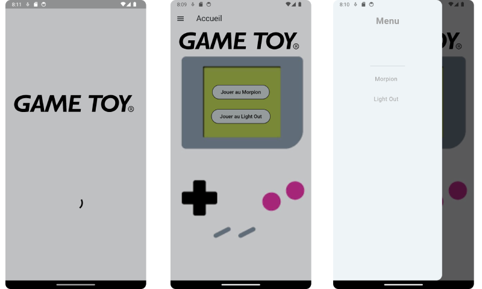
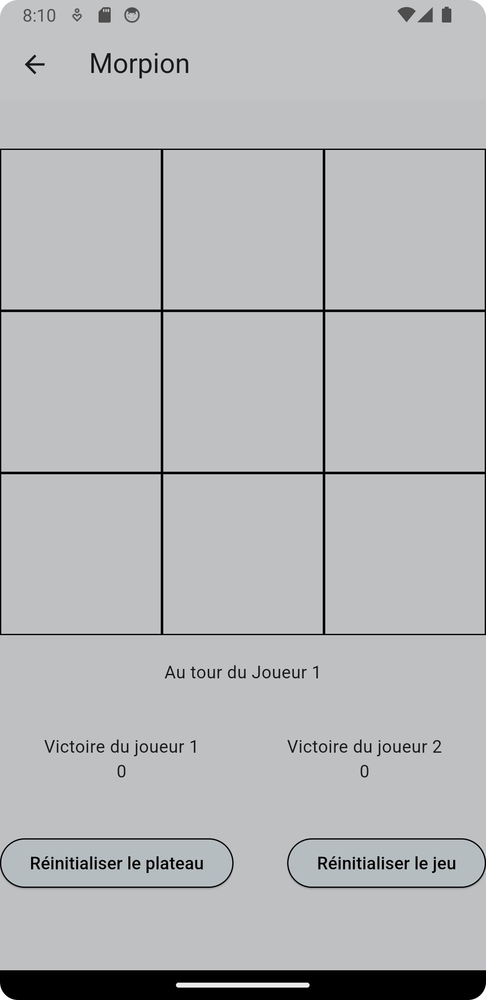

# GameToy

Paradice est une application codée en Flutter dans le cadre de mes études en BTS SIO option SLAM. 
Cette application permet de jouer à des jeux , comme le morpion ou le light-out.

## Fonctionnement

L'application démarre sur un splash Screen de 3 s, on est ensuite redirigé sur la page d'accueil sur laquelle se trouvent les boutons pour accéder 
aux jeux soit le morpion ou le light-out. Et un menu déroulant  qui amène aux même autres pages.

### Page morpion :

Sur la page morpion , nous avons accès au tableau de jeu avec un compteur de victoire pour les deux joueurs et deux boutons , 1 pour reinitialiser 
le plateau et un autre pour reinitialiser le jeu.

