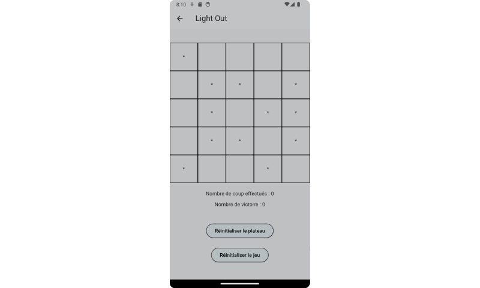

# GameToy

Paradice est une application codée en Flutter dans le cadre de mes études en BTS SIO option SLAM. 
Cette application permet de jouer à des jeux , comme le morpion ou le light-out.

## Fonctionnement

L'application démarre sur un splash Screen de 3 s, on est ensuite redirigé sur la page d'accueil sur laquelle se trouvent les boutons pour accéder 
aux jeux soit le morpion ou le light-out. Et un menu déroulant  qui amène aux même autres pages.

### Page morpion :

Sur la page morpion , nous avons accès au tableau de jeu avec un compteur de victoire pour les deux joueurs et deux boutons , 1 pour reinitialiser 
le plateau et un autre pour reinitialiser le jeu.

### Page light-out :

Sur la page light-out , nous avons accès au tableau de jeu avec un compteur de coups joué , un compteur pour les victoire et deux boutons , 1 pour reinitialiser 
le plateau et un autre pour reinitialiser le jeu.

## Les fichiers

### plateau.dart 

Plateau est une classe qui sert pour créer des plateaux de taille différante.
Elle possède 2 attributs privés _taille qui sert à savoir la taille du plateau et _plateau qui est une variable qui sauvegarde le plateau sous forme de liste.

### player.dart 

Player est une classe qui sert pour créer des joueurs.
Elle possède 3 attributs privés _nom qui stock le nom de l'utilisateur , _nbVictoire qui sert à savoir le nombre de victoire du joueur et _nbCoup qui sert à savoir le coup du victoire du joueur.

### morpion_game.dart 

MorpionG est une classe qui sert pour créer une partie de morpion.
Elle possède 4 attributs privés _plateau qui stock le plateau de jeu , _joueur1 qui stock les données du joueur 1 , _joueur2 qui stock les données du joueur 2 et _tour qui sert à savoir le nombre de tour de la partie.

### lightout_game.dart 

LightoutG est une classe qui sert pour créer une partie de light-out.
Elle possède 4 attributs privés _plateau qui stock le plateau de jeu , _joueur1 qui stock les données du joueur 1  et _tour qui sert à savoir le nombre de tour de la partie.
